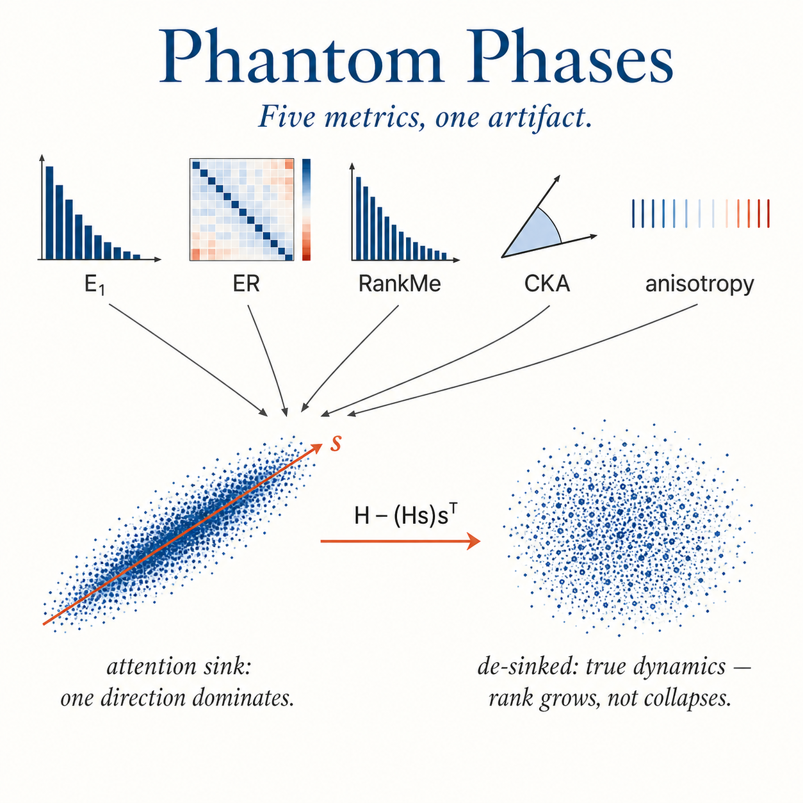

# De-Sinking

<p align="center">
  
</p>

> *Phantom Phases: How Attention Sinks Generate Fictitious Training Dynamics*
> Yuchen Liu, HKUST · NeurIPS 2026 submission

[[Paper (arXiv version)]](paper/main_arxiv.pdf)

Standard spectral metrics applied to transformer hidden states — PCA variance share ($E_1$), effective rank, RankMe, CKA, anisotropy — are systematically contaminated by the *attention sink*. The "geometric phases" and "rank collapse" widely reported in transformer training are largely measurement artifacts. De-sinking, a single rank-1 projection, removes the contamination and reveals a different story: monotonic rank *growth*, not collapse, and a previously invisible shortcut-to-full-rank transition. Distortions reach 721× in effective rank at 6.9B parameters.

## Quick start

```python
from desink import desink, spectral_metrics

# H: hidden states at any layer, shape (n_tokens, d_model)
H_ds = desink(H)

# One line, no library needed:
# H_ds = H - (H @ s)[:, None] * s  where s = PC1 of centered H

print(spectral_metrics(H))     # raw (contaminated)
print(spectral_metrics(H_ds))  # de-sinked (corrected)
```

```bash
pip install -r requirements.txt
```

## Repository layout

```
desink/         core.py            de-sinking + spectral metrics (~80 LOC)
experiments/                       reproducibility scripts, one per paper artifact
paper/          main_arxiv.tex     arXiv version (authored)
                main_neurips.tex   NeurIPS submission (anonymous)
                neurips_2026.sty
                figs/              vector PDF figures
```

## Experiment ↔ paper map

Each script is standalone (no shared state, no inter-script dependencies).

| Script | Paper artifact |
|---|---|
| `fig1_training_trajectory.py`            | Figure 1(a,b): E₁ / ER on 20 Pythia-70M checkpoints |
| `fig1c_theorem_fit.py`                   | Figure 1(c): Theorem 1 fit, R² = 0.978 |
| `fig1b_rank_growth_and_correlation.py`   | §5: Pythia-160M / 1.4B / OLMo-2 1B dynamics + ER-probe correlation |
| `tab2_contamination_audit.py`            | Table 2: contamination across 5 published metrics |
| `fig3_cka_heatmap.py`                    | Figure 3: layer×layer CKA heatmaps |
| `tab3_fig4_scale_validation.py`          | Table 3 + Figure 4: scale validation, 70M → 6.9B |
| `tab_appE_manufacture_and_qwen.py`       | §3.4 synthetic sink injection; Qwen2.5 GQA audit |
| `fig5a_alignment_peak.py`                | Figure 5(a): Pythia alignment peak |
| `fig5a_olmo_alignment.py`                | Figure 5(a): OLMo-2 1B validation |
| `fig5b_perlayer_departure.py`            | Figure 5(b): inverted-U per-layer departure |
| `fig6_capability_vs_sink.py`             | Figure 6: capability vs sink growth |
| `sink_emergence_checkpoints.py`          | §7: sink formation across training |
| `controls_random_direction.py`           | §8: matched-random direction control |
| `controls_abt_comparison.py`             | §8: All-but-the-Top vs de-sinking |
| `controls_spectral_gap.py`               | §8: eigenvalue gap analysis |
| `tab_appB_probing.py`                    | Appendix B: probing on Pythia-70M (large-scale) |
| `tab_appB_probing_multi.py`              | Appendix B: probing across 3 models |
| `tab_appD_sink_geometry.py`              | Appendix D: sink ↔ unembedding geometry |
| `app_negative_pruning.py`                | Appendix C: layer pruning (negative result) |
| `app_negative_lora.py`                   | Appendix C: LoRA layer selection (inconclusive) |
| `app_negative_cross_cka.py`              | Appendix C: cross-model CKA |
| `app_negative_distillation.py`           | Appendix C: distillation layer matching |

## Reproducing results

```bash
python experiments/fig1_training_trajectory.py    # ~30 min on A100
python experiments/tab2_contamination_audit.py    # ~20 min
python experiments/tab3_fig4_scale_validation.py  # needs ~40 GB GPU for Pythia-6.9B
```

All models are public Hugging Face checkpoints (GPT-2, Pythia, OLMo-2, Qwen2.5). Total compute for the full paper: ~10 GPU-hours on a single A100.

## Citation

```bibtex
@inproceedings{liu2026phantom,
  title  = {Phantom Phases: How Attention Sinks Generate Fictitious Training Dynamics},
  author = {Liu, Yuchen},
  booktitle = {Advances in Neural Information Processing Systems},
  year   = {2026}
}
```

MIT license.
